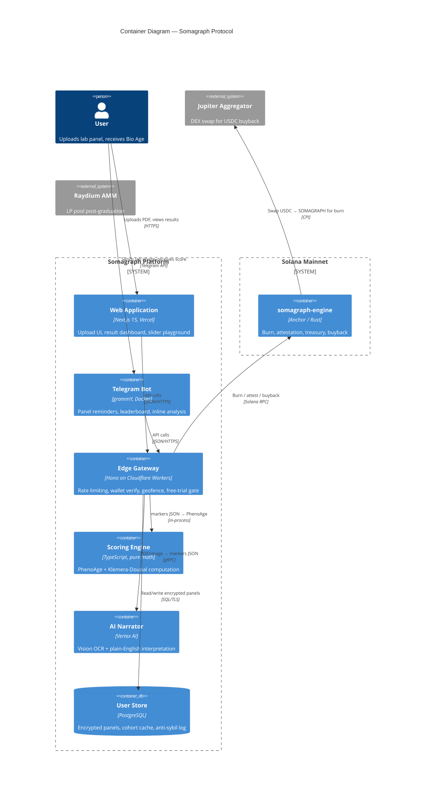

<div align="center">

# SOMAGRAPH

### Decode Your Biological Age. 60 Seconds. Price of a Coffee.

**Somagraph** turns the cryptic PDF from your doctor into an actionable longevity score.
Upload your blood test, get your Bio Age, get the recommendations your GP never gave you.
Built on peer-reviewed science. Narrated by AI. Settled on Solana.

[](https://solana.com)
[](https://spl.solana.com/token-2022)
[](LICENSE)
[](https://pump.fun)
[](https://somagraph.bio)
[](https://x.com/somagraph)

</div>

---

## What Is Somagraph?

Somagraph is an open-access longevity intelligence layer. Anyone with a lab panel from Quest, Labcorp, an employer checkup, or a hospital discharge form can drop the PDF in, and within sixty seconds receive:

1. A **peer-reviewed Biological Age estimate** (Levine PhenoAge + Klemera-Doubal method)
2. A **Longevity Score** (0-100)
3. A **prioritized action list** of biomarkers to focus on, written in plain language by AI

The analysis costs roughly the same as a coffee. Your library of past panels lives forever on-chain as cryptographic attestations.

## Core Mechanics

```
┌─────────────────────────────────────────────────────────────────────┐
│                                                                     │
│   1. UPLOAD              2. PARSE                3. SCORE          │
│   Lab PDF / image /      AI vision OCR           PhenoAge formula  │
│   manual entry           → 50+ markers           Klemera-Doubal     │
│                          extracted as JSON       → Bio Age           │
│         │                       │                → Longevity 0-100   │
│         ▼                       ▼                       ▼           │
│                                                                     │
│   4. NARRATE             5. RECOMMEND            6. ATTEST          │
│   AI explains each       Prioritized action      On-chain hash      │
│   value for YOUR         plan with estimated     attestation via     │
│   profile specifically   bio-age impact per      somagraph-engine    │
│                          intervention            Anchor program      │
│                                                                     │
└─────────────────────────────────────────────────────────────────────┘
```

## Token Utility — $SOMAGRAPH

| Mechanic             | Detail                                                              |
| -------------------- | ------------------------------------------------------------------- |
| **Total Supply**     | 1,000,000,000 $SOMAGRAPH (6 decimals)                                    |
| **Standard**         | SPL Token-2022 with BurnAuthority + MetadataPointer                 |
| **First Analysis**   | Free (1 per wallet, lifetime)                                       |
| **Subsequent**       | 1,000 $SOMAGRAPH burned **or** $5 USDC — whichever is lower in USD value |
| **USDC Split**       | 50% auto-buyback & burn via Jupiter / 50% protocol treasury         |
| **Mint Authority**   | Disabled at launch                                                  |
| **Freeze Authority** | Disabled at launch                                                  |

### Holder Tiers

| Tier   | Requirement    | Access                                            |
| ------ | -------------- | ------------------------------------------------- |
| Free   | Any wallet     | 1 lifetime free analysis                          |
| Holder | Any $SOMAGRAPH      | Pay-per-analysis at lower-of pricing              |
| Whale  | 100,000+ $SOMAGRAPH | Beta features 14d early, community roadmap voting |

> **Note:** Whale tier confers _access_, not yield. No staking, no APR, no passive income claims.

## How It Works

```
USER
 │
 ├── somagraph.bio (Next.js 15 / Vercel)
 ├── @somagraph_bot (Telegram / grammY)
 └── Public API (V1+)
      │
      ▼
 ┌──────────────────────┐
 │   Edge API Gateway   │
 │   rate-limit · auth  │
 │   free-trial check   │
 │   geofence           │
 └──────────┬───────────┘
            │
   ┌────────┼────────┐
   ▼        ▼        ▼
 Vision   PhenoAge  Solana
 OCR +    Compute   Program
 AI       (pure TS) ├── burn_payment
 Narrate            ├── record_analysis
                    ├── usdc_buyback_burn
                    └── protocol_treasury
            │
            ▼
   PostgreSQL (encrypted)
   panel hashes only on-chain
   no raw biomarkers stored plaintext
```

## Architecture

The system is decomposed into five trust boundaries. A comprehensive breakdown lives in [`SYSTEM_DESIGN.md`](SYSTEM_DESIGN.md).



## Tech Stack

| Layer        | Technology                 | Rationale                             |
| ------------ | -------------------------- | ------------------------------------- |
| Frontend     | Next.js 15, React 19       | SSR + edge runtime                    |
| Styling      | Tailwind CSS 4             | Rapid prototyping                     |
| Edge Gateway | Hono on Cloudflare Workers | Sub-10ms latency, global              |
| Scoring      | TypeScript (pure math)     | Deterministic, no API dependency      |
| AI / OCR     | Vertex AI (vision + text)  | Best-in-class medical OCR             |
| Database     | PostgreSQL (managed)       | Encrypted at rest, row-level security |
| Bot          | grammY framework           | TypeScript-native Telegram SDK        |
| On-Chain     | Anchor (Rust) on Solana    | SPL Token-2022 composability          |
| CI/CD        | GitHub Actions             | Automated build + test + deploy       |
| Monitoring   | Axiom + PagerDuty          | Real-time observability               |

## Tokenomics Distribution

```
  COMMUNITY (PumpFun fairlaunch)    ████████████████████████████████████ 75%
  PROTOCOL TREASURY                 ████████                             15%
  ECOSYSTEM & INTEGRATIONS          █████                                 8%
  TEAM                              █                                     2%
```

- **Community (75%):** 750M tokens, 100% on PumpFun bonding curve, no presale
- **Protocol Treasury (15%):** 150M tokens, 4-year vest, 6-month cliff
- **Ecosystem (8%):** 75M tokens, lab partnerships, influencer deals, bug bounty
- **Team (2%):** 25M tokens, 4-year vest, 12-month cliff

## Roadmap

| Phase                | Timeline    | Deliverables                                                                                                                  |
| -------------------- | ----------- | ----------------------------------------------------------------------------------------------------------------------------- |
| **V0 — MVP**         | Weeks 1-2   | Landing page, PDF upload, PhenoAge calc, slider playground, wallet connect, USDC payment, famous bio ages, Twitter share card |
| **V0.5 — Token**     | Week 3      | $SOMAGRAPH PumpFun launch, 1,000-token burn gate, live burn dashboard                                                              |
| **V1 — Cohort**      | Weeks 4-8   | AI-generated profiles, cohort percentile comparison, panel history, Telegram bot, Apple Health import                         |
| **V2 — Integration** | Months 3-4  | Quest API, multi-language (ID/ES), ethnicity calibration v1, public API, holder Discord                                       |
| **V3 — Research**    | Months 5-12 | Anonymous cohort research, genetic risk overlay (23andMe), longitudinal studies                                               |

## Reference Links

| Resource         | URL                                                                                                       |
| ---------------- | --------------------------------------------------------------------------------------------------------- |
| Website          | [somagraph.bio](https://somagraph.bio)                                                                    |
| X / Twitter      | [@somagraph](https://x.com/somagraph)                                                                     |
| Telegram Channel | [t.me/somagraph](https://t.me/somagraph)                                                                  |
| Telegram Bot     | [@somagraph_bot](https://t.me/somagraph_bot)                                                              |
| GitHub           | [github.com/somagraph](https://github.com/somagraph)                                                      |
| Whitepaper       | [`somagraph-docs/WHITEPAPER.md`](https://github.com/somagraph/somagraph-docs/blob/main/WHITEPAPER.md)     |
| Security Model   | [`somagraph-docs/THREAT_MODEL.md`](https://github.com/somagraph/somagraph-docs/blob/main/THREAT_MODEL.md) |
| API Reference    | [`somagraph-api/ENDPOINTS.md`](https://github.com/somagraph/somagraph-api/blob/main/ENDPOINTS.md)         |

---

<div align="center">
<sub>⚠️ Somagraph provides wellness insights derived from peer-reviewed longevity research formulas.<br>Results are informational and educational, not medical advice. Always consult a licensed physician before making changes to your health regimen.<br>$SOMAGRAPH is a utility token, not a security. It confers no equity and no claim on protocol revenue.<br>Smart contract risk exists. Do not deploy capital you cannot afford to lose.</sub>
</div>
