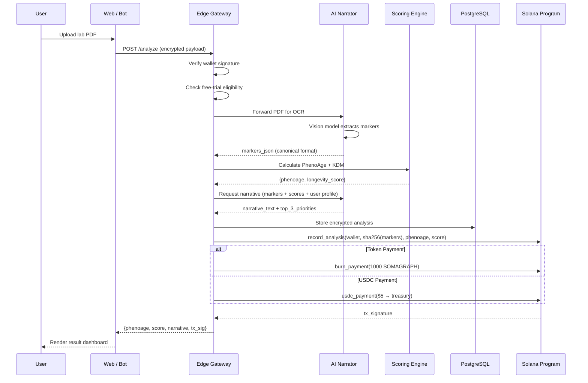
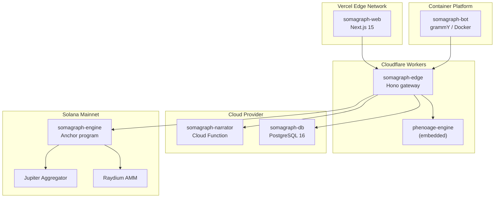

# System Design — Somagraph Protocol

> C4 Container-level architecture document describing system boundaries, data flow, trust zones, and deployment topology.

---

## 1. System Context

Somagraph sits at the intersection of three domains: consumer health tech, AI inference, and Solana DeFi. The system accepts unstructured medical documents, extracts structured biomarker data, computes deterministic biological age scores, and records immutable attestations on-chain.

```
                    ┌──────────────────┐
                    │      USER        │
                    │  (browser / TG)  │
                    └────────┬─────────┘
                             │
            ┌────────────────┼────────────────┐
            ▼                ▼                ▼
   ┌──────────────┐  ┌──────────────┐  ┌──────────────┐
   │   somagraph  │  │  @somagraph  │  │  Public API  │
   │   .bio       │  │  _bot        │  │  (V1+)       │
   │  (Next.js)   │  │  (grammY)    │  │  (REST)      │
   └──────┬───────┘  └──────┬───────┘  └──────┬───────┘
          │                 │                 │
          └─────────────────┼─────────────────┘
                            ▼
               ┌─────────────────────────┐
               │   EDGE GATEWAY          │
               │   Hono / CF Workers     │
               │   ─────────────────     │
               │   • TLS termination     │
               │   • Rate limit (100/min)│
               │   • Wallet signature    │
               │     verification        │
               │   • Free-trial oracle   │
               │   • Geofence (OFAC)     │
               └────────────┬────────────┘
                            │
       ┌────────────────────┼────────────────────┐
       ▼                    ▼                    ▼
 ┌──────────────┐   ┌──────────────┐     ┌──────────────┐
 │  AI LAYER    │   │  SCORE ENGINE│     │  SOLANA      │
 │              │   │              │     │  PROGRAM     │
 │  Vision OCR  │   │  PhenoAge    │     │              │
 │  (multimodal │   │  Klemera-    │     │  Anchor      │
 │   inference) │   │  Doubal      │     │  IDL         │
 │              │   │              │     │              │
 │  Narrator    │   │  Pure TS     │     │  ┌─────────┐ │
 │  (text gen)  │   │  No API dep  │     │  │ burn    │ │
 └──────────────┘   └──────────────┘     │  │ attest  │ │
                            │            │  │ buyback │ │
                            ▼            │  │ treasury│ │
               ┌──────────────────────┐  │  └─────────┘ │
               │  POSTGRESQL          │  └──────────────┘
               │  (encrypted at rest) │
               │                      │
               │  • user_analyses     │
               │  • cohort_cache      │
               │  • antisybil_log     │
               │  • aggregate_stats   │
               └──────────────────────┘
```

---

## 2. Container Inventory

### 2.1 Web Application

| Property | Value |
|----------|-------|
| **Name** | somagraph-web |
| **Type** | Server-rendered web application |
| **Technology** | Next.js 15 (App Router), React 19, Tailwind CSS 4 |
| **Deployment** | Vercel Edge Network |
| **Responsibilities** | Upload UI, result dashboard, slider playground, sample profiles, famous bio ages, Twitter share card generation |

### 2.2 Telegram Bot

| Property | Value |
|----------|-------|
| **Name** | somagraph-bot |
| **Type** | Long-polling bot service |
| **Technology** | grammY framework, TypeScript, Docker |
| **Deployment** | Railway / Fly.io container |
| **Responsibilities** | Inline analysis, panel re-test reminders, community leaderboard, wallet linking |

### 2.3 Edge Gateway

| Property | Value |
|----------|-------|
| **Name** | somagraph-edge |
| **Type** | API gateway / middleware |
| **Technology** | Hono framework on Cloudflare Workers |
| **Deployment** | Cloudflare global edge (300+ PoPs) |
| **Responsibilities** | Authentication, rate limiting (token bucket), geofencing (OFAC blocklist), free-trial oracle, request routing |

### 2.4 Scoring Engine

| Property | Value |
|----------|-------|
| **Name** | phenoage-engine |
| **Type** | Compute library (embedded) |
| **Technology** | TypeScript, zero external dependencies |
| **Deployment** | Bundled into Edge Gateway (in-process) |
| **Responsibilities** | PhenoAge formula computation, Klemera-Doubal supplementary scoring, unit conversion, marker normalization |

### 2.5 AI Narrator

| Property | Value |
|----------|-------|
| **Name** | somagraph-narrator |
| **Type** | AI inference service |
| **Technology** | Vertex AI SDK (vision + text generation) |
| **Deployment** | Cloud Function (on-demand invocation) |
| **Responsibilities** | PDF/image OCR via multimodal vision, biomarker extraction to JSON, plain-English narrative generation, top-3 priority synthesis |

### 2.6 User Store

| Property | Value |
|----------|-------|
| **Name** | somagraph-db |
| **Type** | Relational database |
| **Technology** | PostgreSQL 16 (managed) |
| **Deployment** | Cloud SQL / equivalent managed service |
| **Responsibilities** | Encrypted panel storage (AES-256-GCM, user wallet pubkey), cohort statistics cache, anti-sybil event log, aggregate analytics |

### 2.7 Solana Program

| Property | Value |
|----------|-------|
| **Name** | somagraph-engine |
| **Type** | On-chain smart contract |
| **Technology** | Anchor framework (Rust), SPL Token-2022 |
| **Deployment** | Solana Mainnet-Beta |
| **Responsibilities** | Token burn execution, analysis attestation (SHA-256 hash), USDC buyback-and-burn (24h cron via Jupiter CPI), protocol treasury management (3-of-5 multisig) |

---

## 3. Data Flow — Analysis Pipeline



---

## 4. Trust Boundaries

```
ZONE 0 — USER DEVICE (untrusted)
  Browser / Telegram client
  Wallet holds signing keys
  Panel encrypted client-side before upload

ZONE 1 — EDGE PERIMETER (semi-trusted)
  Cloudflare Workers
  Decrypts → processes → re-encrypts
  No persistent storage of plaintext

ZONE 2 — COMPUTE (trusted, ephemeral)
  AI Narrator: stateless function invocation
  Scoring Engine: deterministic, embedded
  No biomarker data persisted after response

ZONE 3 — STORAGE (trusted, encrypted)
  PostgreSQL: AES-256-GCM at rest
  Only wallet pubkey can decrypt
  Right-to-delete via wallet signature

ZONE 4 — ON-CHAIN (public, immutable)
  Only SHA-256 hashes of normalized markers
  No PII, no raw biomarkers
  Attestation + burn records only
```

---

## 5. Deployment Topology



---

## 6. Scaling Considerations

| Component | Scaling Strategy | Trigger |
|-----------|-----------------|---------|
| Web App | Vercel auto-scale (edge functions) | Concurrent requests > 1000 |
| Edge Gateway | Cloudflare Workers auto-scale | Automatic, per-request |
| AI Narrator | Cloud Function concurrency (max 100) | Queue depth > 50 |
| Scoring Engine | Embedded in Edge, no separate scaling | N/A |
| PostgreSQL | Vertical (16 vCPU / 64GB) → read replicas | Connection count > 500 |
| Telegram Bot | Horizontal pod scaling | Message throughput > 100/s |
| Solana Program | N/A (on-chain, bounded by Solana TPS) | N/A |

---

## 7. Security Architecture

See [`somagraph-docs/THREAT_MODEL.md`](https://github.com/somagraph/somagraph-docs/blob/main/THREAT_MODEL.md) for the full threat model.

Key design decisions:

1. **Zero plaintext storage.** Biomarker data encrypted with user wallet pubkey before persistence.
2. **On-chain hashes only.** SHA-256 of normalized marker JSON; no PII on Solana.
3. **Geofence at launch.** US (HIPAA), UK (DPA), China (cybersecurity law), OFAC sanctioned countries blocked in V0.
4. **Audit before mainnet.** OtterSec / Halborn review of Anchor program. Penetration test of Edge Gateway.
5. **Right to delete.** User signs a wallet message → all encrypted records purged from PostgreSQL.

---

<div align="center">
<sub>

System design locked 2026-05-05. This document tracks the intended architecture. Implementation may diverge; deviations are recorded in CHANGELOG.md.

</sub>
</div>
